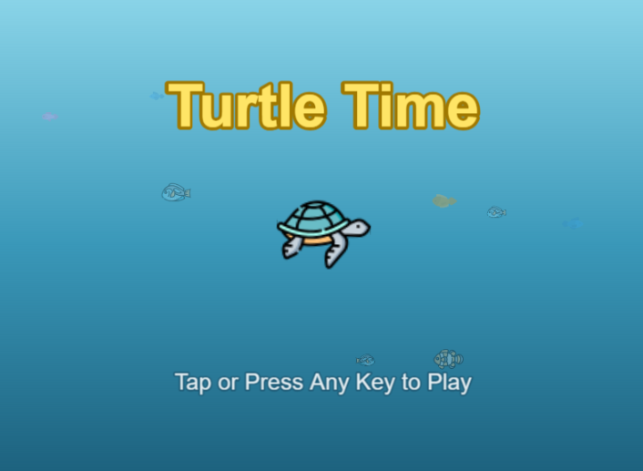
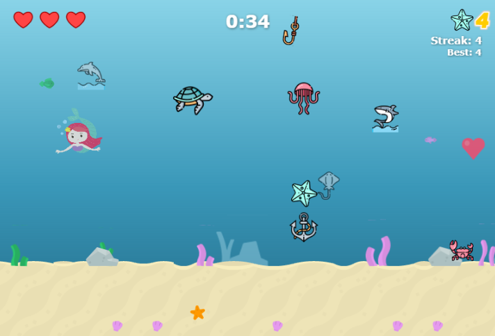
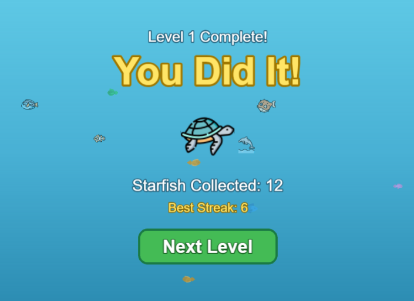

# Turtle Time

**Turtle Time** is a 2D horizontal-scrolling underwater exploration game designed for toddlers. The player controls a sea turtle swimming through a colorful ocean environment, collecting starfish, dodging friendly hazards, and encountering vibrant sea life along the way.

This game was built for my young daughter to explore marine life, while I teach myself a new set of AI tools.

## Screenshots







## Features

- **Simple controls** -- keyboard (arrow keys / WASD), mouse, or touch input
- **Gentle gameplay** -- forgiving difficulty with a heart-based life system and brief invincibility after hits
- **Scrolling ocean world** -- parallax backgrounds, sand terrain, seaweed, coral, rocks, and ambient bubbles
- **Collectible starfish** -- swim through the ocean collecting starfish for points
- **Ocean hazards** -- jellyfish, sharks, anchors, fish hooks, and eels provide light challenge
- **Ambient sea life** -- dolphins, whales, octopuses, crabs, seahorses, and schools of fish bring the ocean to life
- **Mobile-friendly** -- responsive layout with touch controls, scales to fit any screen
- **Title screen and victory celebration** -- a complete experience from start to finish

## Built With

- [Phaser.js](https://phaser.io/) (v3.60) -- 2D game framework
- [Claude Code](https://claude.ai/claude-code) and [Cursor](https://cursor.com/) -- AI-assisted development tools
- JavaScript (ES modules)

## How to Run

Turtle Time runs in any modern browser but requires a local web server due to ES module imports. The simplest approach is Python's built-in HTTP server.

1. Clone the repository:

   ```bash
   git clone https://github.com/andysalads/turtle-time.git
   cd turtle-time
   ```

2. Start a local server:

   ```bash
   python -m http.server 8000
   ```

3. Open your browser and navigate to:

   ```
   http://localhost:8000
   ```

## License

Game art assets are provided under the terms described in `assets/License.txt`.
